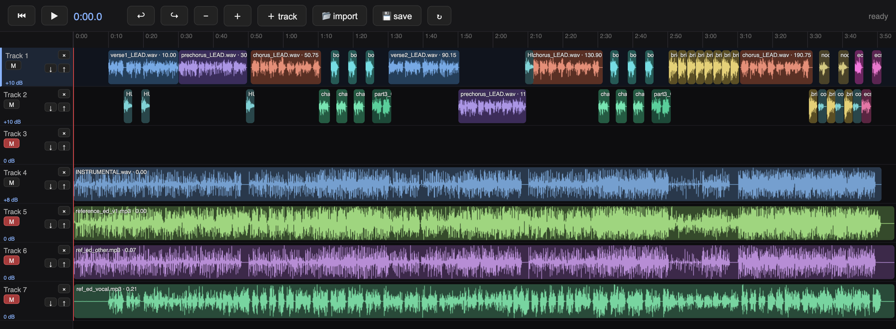

# hackdaw

A tiny, hackable DAW that lives in the browser and renders on your machine.



The browser is the UI, Python + ffmpeg are the render farm, and one JSON file
is the whole project. Everything is non-destructive: your media is never
modified, only `timeline.json` changes. Born making a full song parody
(vocals, mix, and music video) — now a general-purpose music **and** video
editor in ~4 small files you can actually read.

## Why

- **No project lock-in.** A project is a folder of media plus one readable
  `timeline.json`. Version it, diff it, generate it from a script.
- **Hackable mixing.** The mix chain is ~80 lines of
  [pedalboard](https://github.com/spotify/pedalboard) Python. Don't like it?
  Copy it, change it (see `examples/`).
- **Preview = render.** The editor's monitor and the ffmpeg compositor share
  the same layering rules, so what you see is what renders.

## Quickstart

```bash
git clone https://github.com/lout33/hackdaw && cd hackdaw
python3 -m venv .venv && .venv/bin/pip install -r requirements.txt
# ffmpeg needed for video rendering:  brew install ffmpeg  (or apt install ffmpeg)

python3 serve.py                    # opens the bundled demo project
# -> edit at http://localhost:8093/editor.html
```

Your own song:

```bash
python3 new.py my_song vocals.wav instrumental.wav cover.png
python3 serve.py my_song                      # edit + save in the browser
.venv/bin/python timeline.py my_song          # render audio -> my_song/mix.wav
.venv/bin/python video_render.py my_song      # render video -> my_song/final_video.mp4
```

The loop: edit in the browser → 💾 save → render audio → render video → listen
→ repeat.

## The pieces

```
editor.html       the whole UI — one file, no build step, no dependencies
serve.py          python3 serve.py [folder] → http://localhost:8093/editor.html
                  serves the project folder; PUT saves timeline.json,
                  POST /upload imports media dropped into the browser
new.py            scaffold a project folder from media files
timeline.py       AUDIO renderer: timeline.json → mixed wav
                  (pedalboard: instrumental pocket EQ, room on vocals,
                  glue compressor, peak normalize)
video_render.py   VIDEO renderer: composites video/image clips over black
                  @1080p30 with ffmpeg, muxes in the mixed audio
examples/         copy-paste renderers for custom mix chains
```

A project folder:

```
my_song/
├── vocals.wav  clip.mp4  cover.png  …   media (raw, never touched)
└── timeline.json                        the entire project state
```

## The editor

Tracks are generic lanes; a clip is audio, video, or image depending on file
extension. Audio clips get waveforms, video clips get a poster-frame
filmstrip, images get tiles. Video/image preview plays in a floating monitor
synced to the transport — topmost lane wins, muted tracks are skipped, same
rule as the final render.

Drag / trim / split (`S`) / delete · multi-select (box or ⇧click) · group move
· ⌘C/⌘V paste at playhead · ⌘D duplicate · undo/redo · per-track mute + live
gain sliders · track add/delete/reorder · zoom · drag-drop or 📂 import
(audio + mp4/mov/webm/png/jpg/gif). Stills default to 5 s — trim to taste.

## timeline.json

```json
{
  "vocal_anchor": 1.0,
  "n_tracks": 3,
  "stems":  { "vocals": "vocals.wav", "cover": "cover.png" },
  "clips":  [ { "stem": "vocals", "start": 12.5, "track": 1,
                "trim_start": 0.8, "trim_end": 9.2, "gain_db": -1.5 } ],
  "track_gains":  { "1": -2.0 },
  "muted_tracks": [ 3 ]
}
```

Times in seconds. A stem named `INSTRUMENTAL` gets the instrumental bus
treatment in the audio renderer; everything else is treated as a vocal.
Audio stems should be 48 kHz WAV.

## Roadmap

1. Audio from video clips (extract/mute toggle — today video is visuals-only)
2. Per-clip gain UI + clip overlap rules
3. Text/title clips (ffmpeg drawtext) for lyrics/captions
4. Transitions (crossfade / dip-to-black)

## License

MIT
